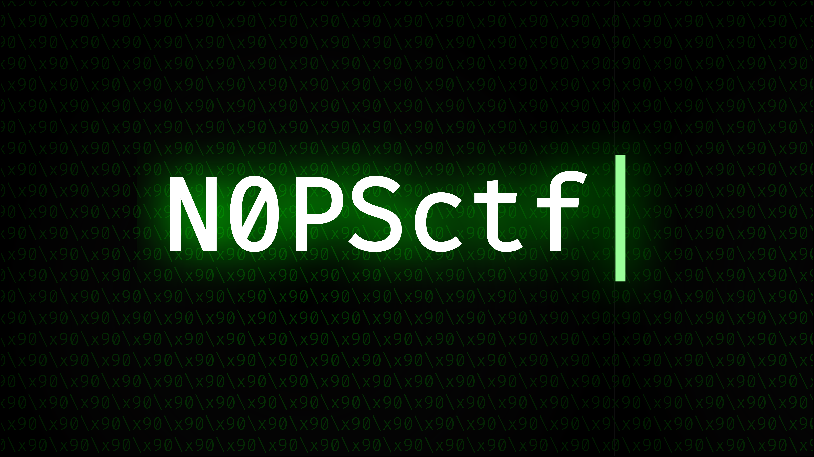

  
  <h1 style=>N0PSctf | First Edition</h1>
  

     This repository encompasses the official write-ups and source code for the first edition of N0PSctf.
  

  

    <a href="https://www.nops.re">Website</a> | <a href="https://discord.com/invite/xqvnaGzG6x">Discord</a>
  

## N0PSctf 

The first edition of N0PSctf was hosted on June 1st and 2nd, attracting over 1,000 participants from around the globe. The competition spanned 36 intense hours, during which our participants became experts in Japanese bridges. The team PWNSec emerged victorious, marking a significant achievement as it was their first Capture the Flag (CTF) competition, just like it was ours.

  

## Categories

- 🔑 [Cryptography](crypto)
- 🍪 [Web](web) 
- 🕵️ [OSINT](osint) 
- ⚙️ [Reverse engineering](rev) 
- 🤓 [PWN](pwn) 
- 👽 [Miscellaneous](misc) 
- 💾 [Forensics](forensics) 
- 🤖 [AI](ai) 

## Storyline 
In the echoing corridors, a phrase whispered among students held the allure of a secret incantation - Jojo. It was a name that carried weight, spoken with hushed reverence, yet veiled in mystery like a cyberlegend waiting to be unveiled.

Legend whispers of Jojo, rumored to be a digital virtuoso capable of manipulating code with unparalleled finesse. Yet, as anticipation mounts, a twist of fate sends shockwaves through the digital realm, vanishing Jojo without a trace. Left in Jojo's wake are mere whispers and conjecture, as if the legend itself had dissolved into the shadows of cyberspace, daring the world to uncover the truth.

## License
With the exception of the names of N0PSctf organizers and of the CTF itself, and unless another license is stated in the corresponding directory or takes precedence in any way, the content of this repository is provided under the [CC-BY-4.0 license](LICENSE).

