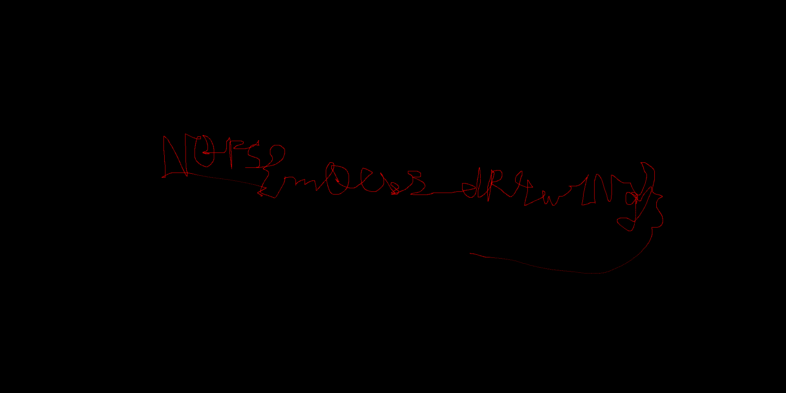
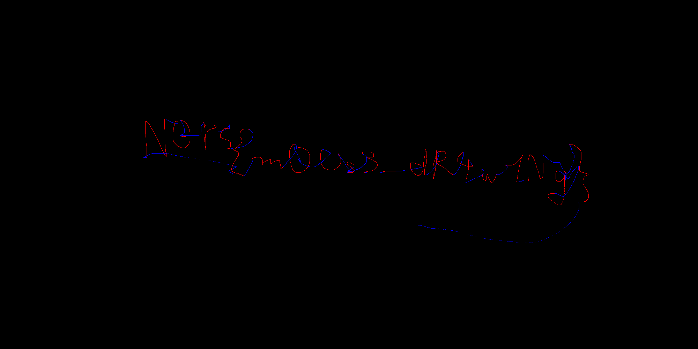

- [HID Writeup](#hid-writeup)
  - [Description](#description)
  - [Solution](#solution)
    - [Identify the address of the HID device](#identify-the-address-of-the-hid-device)
    - [Extract the data sent from the HID device](#extract-the-data-sent-from-the-hid-device)
    - [Analyze the HID Data](#analyze-the-hid-data)
    - [Python script](#python-script)
    - [Results](#results)
  - [Flag](#flag)

# HID Writeup

## Description
Description of the challenge: `what did I write ???`.

## Solution
This challenge provides a `pcapng` file that captures data from a HID USB device (mouse) when drawing.

Overview: We will analyze the HID data, extract data from the `pcapng` file, and parse the extract data to draw an image.

### Identify the address of the HID device
Open the `pcapng` file in wireshark and go to `Statistics` >`Endpoints`. Tick on USB in Protocol and go to `USB` tab. We will see that the IP address sent a lot of packets (13093 packets) is `3.11.1`.

### Extract the data sent from the HID device
We will use `tshark` to extract the HID data. Before that, we need some parameters:
- In wireshark, right click on a packet sent from `3.11.1` and choose `Apply as filter` > `Selected`. We will see that the filter is `usb.addr == 3.11.1`
- In the `Packet Details` pane, expand the `HID Data` field. Right click on the `HID Data` field and choose `Copy` > `Field Name`. We will see that the name is `usbhid.data`.
- To extract data, in terminal, run
```bash
tshark -r capture.pcapng -Y "usb.src == 3.11.1" -T fields -e usbhid.data > extracted_data
```
where the parameters are:
- `-r`: in file (`--read-file`)
- `-Y`: Display filter
- `-T`: Format of text output
- `-e`: Field to print if `-T fields` is selected
- `> extracted_data`: Redirect output to file `extracted_data`

The file `extracted_data` has some blank lines. We remove it using `sed`:
```bash
sed -i '/^$/d' extracted_data
```

In the end of this part, we will have `extracted_data` without blank line. We provide this file in [extracted_data/](extracted_data/) folder.

### Analyze the HID Data
- Here is an example of hid data in wireshark. It has 7 bytes.
```text
HID Data: 0101ffff000000
    Report ID: 0x01
    .... ...1 = Button: 1 (primary/trigger): DOWN
    .... ..0. = Button: 2 (secondary): UP
    .... .0.. = Button: 3 (tertiary): UP
    .... 0... = Button: 4: UP
    ...0 .... = Button: 5: UP
    Padding: 00
    1111 1111  1111 1111 = X Axis: -1
    0000 0000  0000 0000 = Y Axis: 0
    0000 0000 = Usage: Wheel: 0
```

- The mouse has 5 buttons. The `X Axis` and `Y Axis` represent the movements of the mouse. From above example, we can guess that
  - The first byte seems to be the same for all packets (`Report ID`), and always be `01`.
  - The second byte is the button status (5 buttons).
  - The third and fourth bytes are the `X Axis`.
  - The fifth and sixth bytes are the `Y Axis`.
  - The seventh byte is the `Wheel` data

Now, we see all the possible values of bytes in the `extracted_data` (in the result, the first column represents the total number of repetitions, the second column represents the value).

- First byte:
```bash
cut -c 1-2 extracted_data | sort | uniq -c
```
```bash
   6544 01
```
We see that all first byte is `01`.

- Second byte:
```bash
cut -c 3-4 extracted_data | sort | uniq -c 
```
```bash
   2644 00
   3900 01
```
We see that the values of button status are `00` or `01`. The ratio of non-pressed mouse (UP) and pressed (DOWN) mouse is about 2/3. It can cause a huge difference if we do not separate the data for this two status of the mouse button.
- Third+fourth:
```bash
cut -c 5-8 extracted_data | sort | uniq -c
```
```bash
   3168 0000
   2115 0100
    108 fdff
    109 feff
   1044 ffff
```
- Fifth+sixth:
```bash
cut -c 9-12 extracted_data | sort | uniq -c 
```
```bash
   2586 0000
   2024 0100
     18 0200
   1916 ffff
```
From Third+fourth and Fifth+sixth bytes, we see all the possible values of the displacements in x and y axis, ranging from `fdff`(or -3) to `0200` (or 3). We will hard code these values in a python script later.
- Seventh:
```bash
cut -c 13-14 extracted_data | sort | uniq -c
```
```bash
   6544 00
```
We see that it does not use wheel.

### Python script
Finally, we write a python script to parse `extracted_data` to create an image: From a point in an image, for a line in `extracted_data`, we update update the position of the point based on the displacements in x and y axis and update the color based on the value of mouse button status.

**Note:** if you don't use the data about the mouse button status, you will get an image with one color. It is difficult to read the flag. But you can still guess somehow (we also provides the image of this case in the [imgs/not_complete_result.png](imgs/not_complete_result.png). This image is created by using the same code but we change `blue` to `red` in the definition of `colormap`)

```python
from PIL import Image

# size of the image. Can be changed to any size that big enough.
width = 2000
height = 1000
img = Image.new("RGB", (width, height))

# starting position of the mouse point
# here we adjust the starting position so that the final image is somehow centered.
# otherwise, just choose to starting at the center of the image by setting x = width // 2 and y = height // 2.
x = width // 3 
y = height // 2

# define some colors and a dictionary to map color with mouse button status
red = (255, 0, 0)
blue = (0, 0, 255)
colormap = {
    '00': blue,
    '01': red,
}

# define the values of 2-byte X axis and Y axis with integer distances
# you can write some code to convert the hex value into corresponding integer values.
# here we hardcode the value for simpler.
displacement = {
    '0000': 0,
    '0100': 1,
    '0200': 2,
    'ffff': -1,
    'feff': -2,
    '0300': 3,
    'fdff': -3
}

with open('extracted_data') as f:
    for line in f: # read the file line by line. Each line has 7 bytes

        # get mouse button status: second byte
        button = line[2:4]

        # get color related to mouse button
        color = colormap.get(button)

        # get displacement in x and y direction
        x_dis = line[4:8]	# third and fourth bytes
        y_dis = line[8:12]	# fifth and sixth bytes
        
        # update pixel position
        x = x + displacement.get(x_dis, None)
        y = y + displacement.get(y_dis, None)

        # draw the pixel
        img.putpixel((x, y), color)

# Save image
img.save("final_result.png")
```

### Results

- **Not complete result**



- **Final result**



## Flag
`N0PS{m0Us3_dR4w1Ng}`