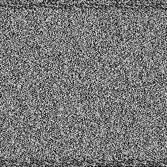

## Strange Pixels

### Description 

iz dat a qRcOdE?
### Solution

We are given this image, that seems to be only made of black and white noise.



Here, we can think that black and white pixels represents 0 and 1, hence encoding binary data. We also see visually that the end of the image is black, which seems to be some kind of padding.

Therefore, we can write a script to decipher the image:

```python
import codecs
from PIL import Image
import numpy as np

bitText = ''

im = np.array(Image.open('pxls.png')

for line in im:
	for pixel in line:
		if pixel == 0:
			bitText += str(pixel)
		else:
			bitText += '1'

while len(bitText) % 8 != 0:
	bitText = bitText[:-1]
while bitText[-8:] == "00000000":
	bitText = bitText[:-8]

hexa = hex(int(bitText, 2))[2:]
text = codecs.decode(hexa, 'hex').decode('ascii')
f = open('out.txt', 'w')
f.write(text)
f.close()
```

This gives us a huge string `iVBORw0KGgoAA[...]g7iAAAAAElFTkSuQmCC`, that is a base64 encoded string.

By decoding it, we get a PNG image that contains the flag.

### Flag

`N0PS{b1n4rY_4s_P1x3Lz}`

