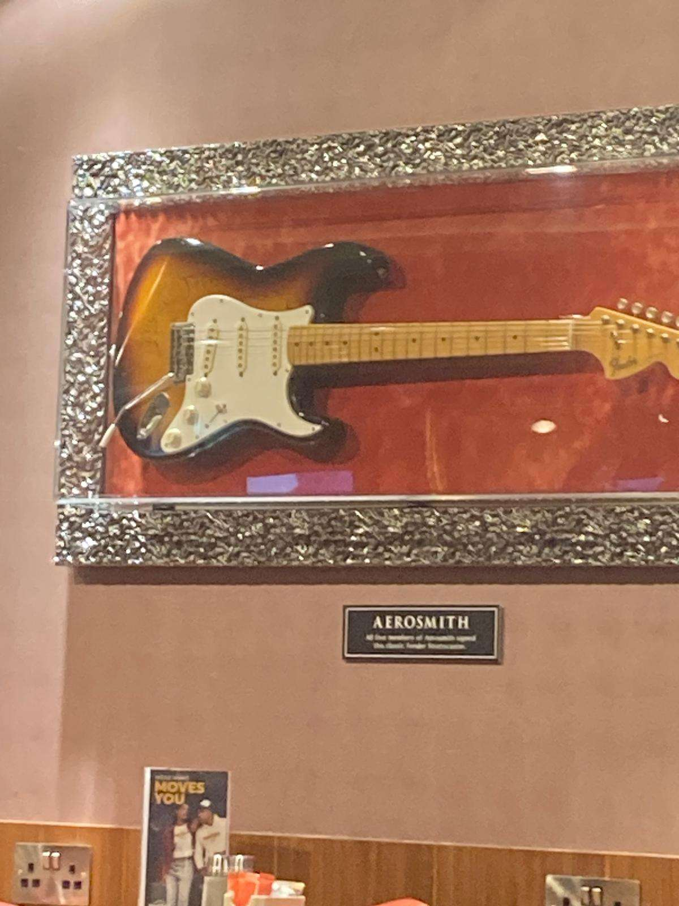

## Rockstar

### Description

I recently went to this place, and I really liked the design of their menu.
Can you tell me which software they used to make it?

### Solution

Looking up the image with Google Image search yields this link as a first [result](https://fr.tripadvisor.ca/LocationPhotoDirectLink-g8565837-d4556785-i313680206-Hard_Rock_Cafe-Luqa_Island_of_Malta.html).
This gives us the place which is Hard Rock Cafe, Malta Airport.   

A simple Google search gives us the Hard Rock Franchise website, and in the [Menu section](https://cafe.hardrock.com/menu.aspx), we can see the local menus for more details.   
To do this, we go into [find your local cafe page](https://cafe.hardrock.com/locations.aspx?utm_source=vizergy&utm_medium=link&utm_campaign=menu-page). After selecting our Hard Rock cafe, we arrive to its [website](https://cafe.hardrock.com/malta-airport/), we find two Menus, a [main one](https://cafe.hardrock.com/malta-airport/files/5425/MIA_Eats_&_Drinks_Menu___2024.pdf) and the Messi one. 

We download the main one and we use exiftool to check its metadata.

This gives us `Creator : Adobe InDesign 19.0 (Windows)`, and flag ! 

_We received several tickets from people not finding the correct menu. It has become a reflex to respond "Wrong PDF :)" whenever we see Adobe InDesign CS6 (Windows). This issue arises because everyone ended up at the Valetta Cafe instead of the Airport one._

#### Flag

`N0PS{Adobe InDesign 19.0 (Windows)}`

