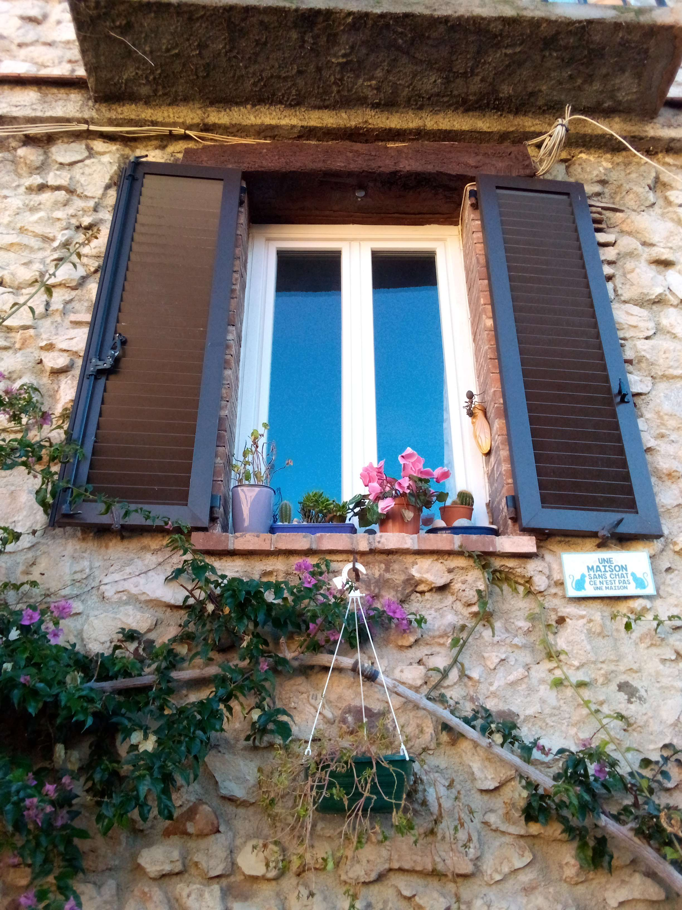

## Where Am I 2

### Description

well done, but now i am even more hidden hihi

_Note: The flag is the concatenation of the city name and the street name in ASCII lowercase (no special character, no commas), words separated by dash (-)
For instance, if the location is New York, 6th Avenue, the flag will be N0PS{New-York-6th-Avenue}._ 

### Solution

The photo shows a window with a small sign underneath that reads, "Une maison sans chat, ce n'est pas une maison," which is French for "A house without cats is not a real house." (That's cute, isn't it? 😊) 

So first, we can guess that the photo was taken in France. 
Now, let's get into the serious stuff.    

We first Google search the image and we find the following similar Images by focusing on each detail of the picture and choosing the most relevant results: 
* [1st Image](https://www.freepik.com/premium-photo/sign-wall-antibes-france_19588555.htm) 
* [2nd Image](https://i0.wp.com/lessoccagirls.com/wp-content/uploads/2022/02/IMG_9148.jpeg) 
* [3rd Image](https://i0.wp.com/lessoccagirls.com/wp-content/uploads/2022/02/IMG_9147.jpeg?fit=3024%2C4032&ssl=1)  

The first photo leads us to **Antibes, France** so that is our main clue.
The two last pics depict the same street as well, so we should investigate further using them as they might lead us to our destination.
We perform a Google image search on the third picture since it offers a broader view of the street.  

This gives the following [booking.com listing](https://www.booking.com/hotel/fr/bijou-apartment-in-old-town-antibes.fr.html) which provides the address on their website. If we check the street **Rue du Haut Castelet** in Maps, we find the house [here](https://www.google.fr/maps/@43.5789265,7.1253459,3a,75y,169.8h,116.26t/data=!3m6!1e1!3m4!1sAWwD3t4PJd60XFULJTCGhA!2e0!7i13312!8i6656?entry=ttu).

And voilà!

### Flag

`N0PS{Antibes-Rue-du-Haut-Castelet}`
