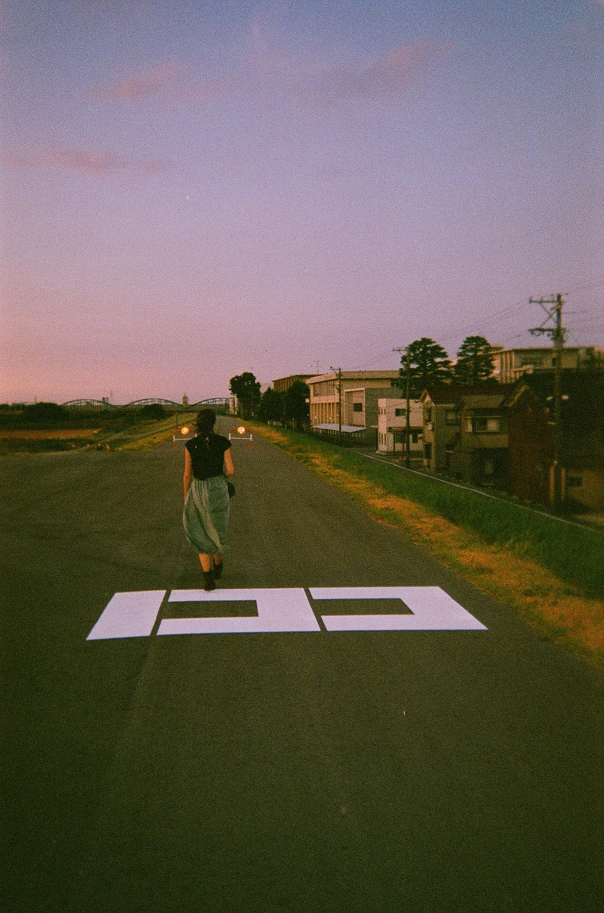

## Where Am I 3

### Description

We have to find the bridge between the person who took this picture.

### Solution

Using the sign written on the road and the architecture of buildings, we can quickly identify that the picture was taken in Japan.

Moreover, as the picture was taken much probably on sunset given the colors, we can tell that the photographer was directed more or less to north, given the position of the Sun.

Then, we can focus on finding the bridge on the background. We can see that it has about 4 arches, and has a somehow blue tint.

Then, by looking at [the list of arch bridges in japan](https://ja.wikipedia.org/wiki/Category:日本のアーチ橋), and look for a bridge that matches our criteria, we end up with [this one](https://ja.wikipedia.org/wiki/%E7%A5%9E%E9%80%9A%E5%A4%A7%E6%A9%8B).

By having a look in the nearby, we can see the river and the road where the picture was taken. 

We use the 3D mode of Google Maps to check the sign on the street and we find it right [here](https://www.google.fr/maps/@36.6936649,137.2017777,3a,60y,5.32h,85.45t/data=!3m6!1e1!3m4!1sNvHgFm0mBbAz7njlwxNpYg!2e0!7i16384!8i8192?coh=205409&entry=ttu). 
We check the name of the bridge we see in the background but a simple search on Google and flag.

#### Flag 

`N0PS{toyamao-bridge}`
