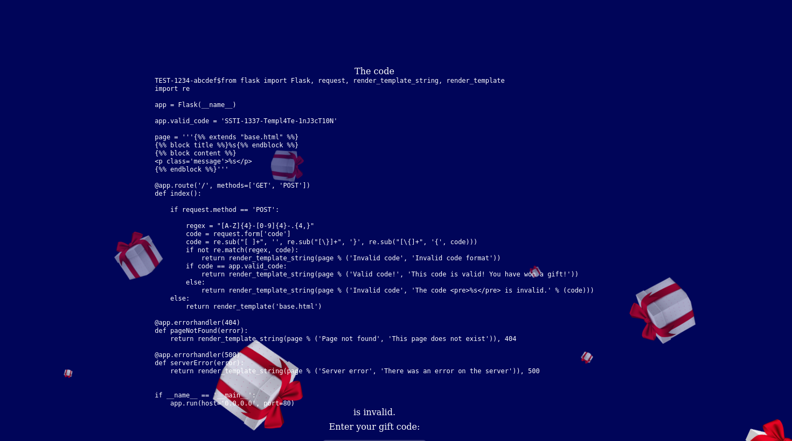

## Get A Gift

### Description

Do you want a gift????   

**Author: algorab**

### Solution

#### Finding the Vulnerability

The first thing we notice is the input field in the page. As a wise man once said : "Never trust user input", we can try some types of payloads to see the reaction of the page. 

We have to use the format of the token given as a placeholder else we obtain an error.


Once we enter the token given as a placeholder, we can see that it is directly printed to the page.   


We can quickly notice that this field is vulnerable to XSS (with payloads like `ABDC-1234-aB<script>alert("gift");</script>`) which is a good finding but useless in that case as this is only reflected in error message. We can also try forms of SQLi, which reveals unsuccessful. The correct intuition for this challenge is basically as it's printed to the page, maybe it is a template injection ([SSTI](https://book.hacktricks.xyz/pentesting-web/ssti-server-side-template-injection))!  

Since there is a specific format to respect, we first try placing {{7\*7}} in the first part of the token (before the first dash). So our payload is `ABD{{7*7}}-1234-aB@358vG`. This actually did not work. We only obtain the wrong format error.  

So we can try the second position with `ABDC-123{{7*7}}-aB@358vG`, but in vain. But, the third one worked with the payload `ABDC-1234-aB@358vG{{7*7}}`!


Nevertheless, we can see that the curly brackets are escaped. So we try the format `ABDC-1234-aB@358vG{ {7*7} }` which gives us the 49! 

#### Getting our Gift

We can try the command

```
TEST-1234-abcdef${ {self._TemplateReference__context.cycler.__init__.__globals__.os.popen('ls').read()} }
```
Which performs an `ls` command in the directory of the `app.py`.
  

We also tried to check other directories `cd ..` etc but this only results in the invalid code error, just like `ls -al`. This made us  assume that spaces are actually escaped.


Therefore, we try to read the source code of the app using the command below :
```
TEST-1234-abcdef${ {self._TemplateReference__context.cycler.__init__.__globals__.os.popen('cat<app.py').read()} }
```
and flag !



_This challenge encompassed several steps, requiring enumeration, the SSTI and bypassing the characters that were escaped._

### Flag

`N0PS{SSTI-1337-Templ4Te-1nJ3cT10N}`
